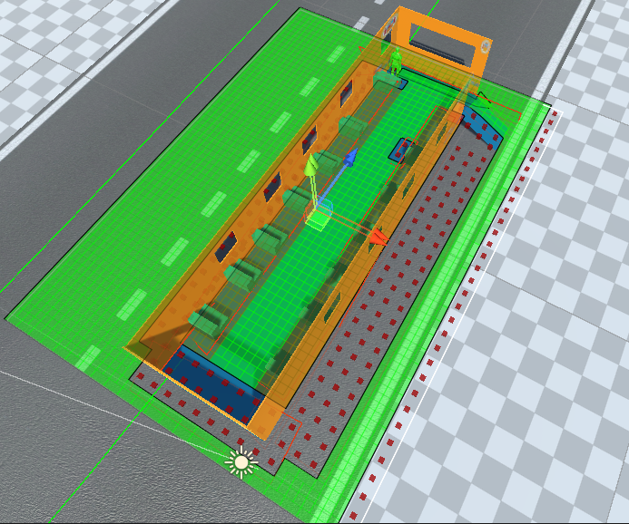

<h1 align = "center">  :computer: 🎓 Simulazione ad agenti nei trasporti 🎓 :computer: </h1>

 A project for my internship at the University of Salerno - ISISlab.

 This project goal is to create a simulation using agents in Unity to track the spreading of disease like Covid-19 on public transport  

   

  

## Tools
- A* Pathfinding Project
- Beizer Path Creator
- Probuilder
- Cinemachine
- EasyRoad3D

### Authors
* **Ciro Maiorino, Antonio Renato Montefusco** - [CiroMaiorino](https://github.com/CiroMaiorino) - [AntonioRenatoMontefusco](https://github.com/AntonioMontefusco)
